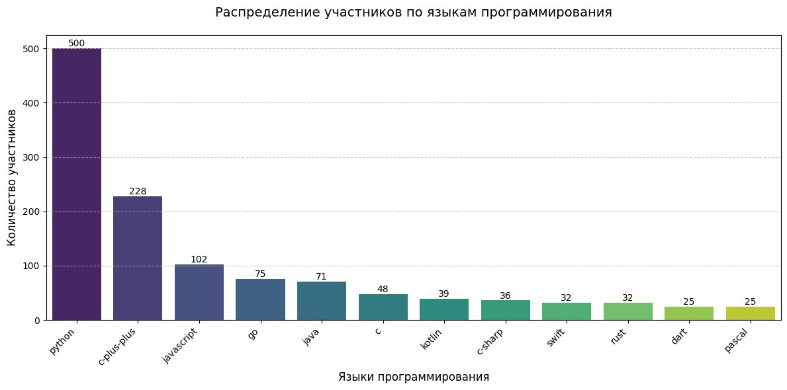
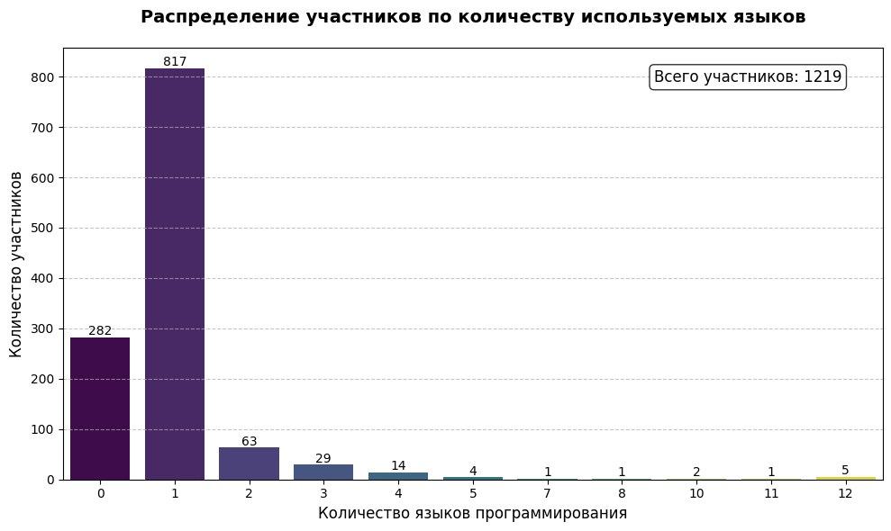

### README: CodeRun Analytics Bot 🤖
Этот Telegram-бот парсит данные с соревнований **[CodeRun Yandex](https://coderun.yandex.ru/seasons/2025-summer/tracks/common/catalog)** и предоставляет аналитику в виде графиков и статистики.

---

## 🚀 Возможности
- **Автоматический парсинг данных** с платформы CodeRun
- Визуализация данных:
  - 📊 Распределение участников по языкам (столбчатые/круговые диаграммы)
  - 📈 Количество языков на участника
- 🔍 Поиск статистики по конкретному пользователю
- ⏱️ Кэширование данных (CSV) для уменьшения нагрузки

---

## 💻 Установка
1. Клонировать репозиторий:
   ```bash
   git clone https://github.com/LeonidMitrofanov/YandexCodeRun_bot.git
   cd YandexCodeRun_bot
   ```

2. Установить зависимости:
   ```bash
   pip install -r requirements.txt  
   ```  

3. Настроить токен бота:  
   Создайте файл `.env` в корне проекта:  
   ```ini  
   BOT_TOKEN=your_telegram_bot_token_here  
   ```  

---

## 🏃 Запуск  
```bash  
python3 -m core  
```  

---

## 📋 Команды бота  
| Команда | Описание | Пример |  
|---------|----------|--------|  
| `/start` | Приветственное сообщение | |  
| `/help` | Справка по командам | |  
| `/update` | Обновить данные с CodeRun | |  
| `/user_by_lang` | Графики по языкам участников | |  
| `/langcnt_by_user` | Распределение языков на участника | |  
| `/user_stats <ник>` | Статистика пользователя | `/user_stats python_pro` |  
| `/contact` | Контакты разработчика | |  

---

## 🧩 Архитектура проекта  
```  
.  
├── core/  
│   ├── analytics/          # Аналитика и визуализация  
│   ├── bot/                # Логика Telegram-бота  
│   │   ├── commands.py     # Обработчики команд  
│   │   ├── keyboards.py    # Клавиатуры  
│   │   └── texts/          # Тексты ответов  
│   ├── parser/             # Парсинг данных CodeRun  
│   └── storage/            # Кэш данных (CSV)  
└── .env                    # Конфигурация  
```  

---

## 📊 Примеры работы  
### Распределение по языкам:  
 
  

### Распределение по кол-ву используемых языков:  
 

### Статистика пользователя:  
```  
📊 Статистика для python_pro:  
PYTHON: 150 баллов (место 5)  
CPP: 120 баллов (место 12)  

📌 Решено задач: 42  
🕒 Последнее решение: 25.06.2025  
```  

---

## ⚠️ Требования  
- Python 3.11+

---

## 📄 Лицензия
Проект распространяется под лицензией **MIT**.
Полный текст: [LICENSE](LICENSE)

---
Разработано с ❤️ для сообщества CodeRun.
Вопросы и предложения: [@alforfon_chik](https://t.me/alforfon_chik)